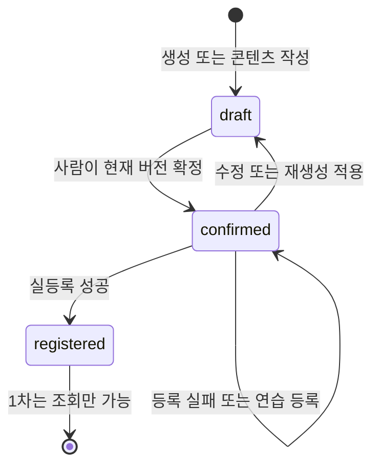

# 어댑터와 서비스 계약

작성일: 2026-09-30. 상태: 내부 계약 설계 v1. 코드 예시는 서명 설계이며 아직 실행 가능한 구현은 아니다. 외부 규격은 [확인 목록](channel-fields.md)에서 별도로 관리한다.

## 책임 구분

api는 입력 검증·기본 인증·서비스 호출·HTTP 응답만 담당한다. services는 Product 저장·작업·비용·확정 상태·등록 이력을 관리하며 구체 어댑터 클래스를 import하지 않는다. adapters/registry.py만 구체 클래스를 생성·등록하고 Protocol을 서비스에 제공한다.

소싱처 어댑터는 파일 1개와 matches·fetch·normalize 3함수를 유지한다. HTTP·브라우저 요청 간격, 다운로드, 비밀 제거, 타임아웃 같은 공통 기능은 공유 도우미에 둔다. 파일마다 복제하지 않는다. 검색은 P1에서 별도 SearchSourceAdapter Protocol로 추가하고 기존 3함수 계약을 늘리지 않는다.

## 결과 객체

| 타입 | 필드 | 조건 |
| --- | --- | --- |
| Issue | code, message, field, severity | severity는 warning/error, message는 한국어 |
| RawProduct | source, source_url, fetched_at, payload, acquisition_mode | payload는 상품 응답 원본, 인증정보 제외 |
| FetchResult | raw, issues | raw가 있으면 정규화 시도, 없으면 수집 실패 |
| NormalizeResult | product, issues | product는 표준 Product 입력 또는 null |
| DetailResult | content, usage, issues | 실패 시 content=null, 부분 성공 보존 |
| ImageResult | images, usage, issues | 성공 자산 목록과 실패 원인을 함께 반환 |
| CategoryResult | categories, issues | 검색 실패를 빈 성공 목록과 구분 |
| RegisterResult | outcome, external_id, external_url, response, issues | outcome은 succeeded/failed/unknown/simulated |

Pydantic v2 모델로 정의하고 원본과 표준 데이터를 구분한다. 네트워크·인증·파싱·공급자 오류는 어댑터 경계에서 결과 객체로 바꾼다. 예상하지 못한 코드 오류도 worker가 작업 실패로 기록하므로 라우터까지 전파하지 않는다. 정규화 실패 시 서비스는 raw를 가진 failed Product를 저장한다.

## 소싱처 계약

```python
class SourceAdapter(Protocol):
    name: str

    def matches(self, url: str) -> bool: ...
    async def fetch(self, url: str) -> FetchResult: ...
    def normalize(self, raw: RawProduct) -> NormalizeResult: ...
```

matches는 URL을 파싱하고 승인된 실제 호스트와 상품 경로를 검사한다. 문자열 포함 검사나 네트워크 요청을 하지 않는다. 도매몰 필드·URL·규격에 의존하는 블록에는 [CHANNEL-SPEC] 주석을 단다. 리다이렉트 대상도 허용된 공개 호스트인지 검사한다.

fetch는 계정 정보를 config 또는 암호화 설정에서 주입받고 결과에 비밀을 포함하지 않는다. API가 가능하면 API를 사용한다. 브라우저 수집은 요청 간격 2초 이상·동시 1개로 제한하며 로그인·CAPTCHA·접근 거부는 결과 오류로 반환한다. 무한 재시도하지 않는다.

normalize는 네트워크·DB·파일 접근이 없는 순수 변환이다. 이름·가격·옵션·재고·이미지·상세·배송을 Product 스키마로 변환한다. 누락은 null과 Issue로 표현한다. 원본 raw를 변경하지 않는다. Product가 표준화된 뒤만 생성 단계로 넘긴다.

manual은 입력 스키마만 설계하고 1차 레지스트리에 등록하지 않는다. mock 소싱처 응답은 mock임을 제품·자산에 기록한다. live 상품인 것처럼 저장하지 않는다.

## 채널 계약

```python
class ChannelAdapter(Protocol):
    name: str

    def validate(self, listing: Listing) -> list[Issue]: ...
    def build_payload(self, listing: Listing) -> dict[str, object]: ...
    async def register(self, payload: dict[str, object]) -> RegisterResult: ...
    async def categories(self, query: str) -> CategoryResult: ...
```

validate·build_payload는 네트워크 없이 동작한다. build_payload는 채널 규격 변환만 하고 상태를 바꾸거나 등록하지 않는다. 규격 불명·매핑 오류는 서비스가 Issue로 변환한다. 예측할 수 없는 값은 임의 기본값으로 넣지 않는다.

register에서 필요한 인증·이미지 업로드·URL 치환·등록 호출을 처리한다. 이미지 업로드 실패가 상품 등록 미전송으로 확인되면 failed, 상품 등록 요청의 수신 여부나 결과를 모르면 unknown이다. 공급자 응답으로 명확히 거절된 경우만 재시도 가능한 failed로 분류한다. 인증 만료 회복도 상품 생성 요청을 무조건 재전송하지 않는다.

mock은 외부 네트워크를 쓰지 않고 simulated를 반환한다. mock payload 스냅샷은 내부 연습 규격이며 공식 등록 규격 검증의 증거로 쓰지 않는다. 도매몰·AI·채널 중 mock 데이터가 포함되면 실등록을 거부한다.

## AI 계약과 비용

```python
class TextGenerator(Protocol):
    async def generate_detail(
        self, product: Product, channel: str, tone: str
    ) -> DetailResult: ...

class ImageGenerator(Protocol):
    async def generate_thumbnails(
        self, product: Product, n: int = 3
    ) -> ImageResult: ...
```

서비스가 호출별 ai_calls 예약을 만든 뒤 어댑터를 호출한다. 공급자별 최대 입력·출력 토큰, 이미지 수·품질, 가격·환산 기준으로 예약액 상한을 계산한다. 가격이나 상한을 모르면 호출하지 않는다. 모델·프롬프트 본문·공급자 호출은 adapters/ai와 prompts에서만 관리한다.

ai_budget_lock 설정 행을 잠그고 일·월 사용액과 미정산 예약을 합산한다. 한도를 넘으면 비용 한도와 남은 금액을 표시하고 종료한다. 예약 커밋 후 running을 기록하고 외부 호출한다. 실제 과금이 확인되면 settled, 미전송·미과금이 확실하면 released, 전송·과금 여부가 불명확하면 unknown이다. 재시작된 running도 unknown이다. unknown은 예약액을 유지하고 공급자 사용량 확인 전 자동 재생성하지 않는다.

usage에는 토큰·이미지 수·공급자 사용량·비용을 저장한다. 비용이 추정이면 실제 비용으로 정산하지 않는다. 공급자 과금 확인 후 사람이 정산 근거를 남긴다. 외부 가격이 바뀌면 pricing_snapshot을 보존하고 후속 호출 설정을 갱신한다. 설정 확정 전 live AI는 비활성화한다.

상품당 썸네일 3안은 공통 자산으로 만든다. 채널별 크기·형식 변환 규칙은 채널 어댑터 설정에 두며 확인 전 mock 규칙만 사용한다. 재생성 성공 결과를 적용할 때 listing 버전을 다시 검사한다. 이전 버전 대상으로 생성했으면 결과 자산은 보존하고 현재 콘텐츠를 덮어쓰지 않는다.

## 상태 전이와 충돌



등록은 listing.status=confirmed 및 confirmed_version=content_version을 트랜잭션에서 검사한다. 생성 직후·확정 직후에는 등록 작업을 만들지 않는다. 화면의 등록 실행 요청만 registration과 job을 만든다. 확정은 내부 필드 검증을 요구하며 미확인 외부 규격은 실등록 검증에서 차단한다.

편집·확정·재생성·등록은 동일 상품과 listing 잠금 순서를 사용한다. 등록 진행 또는 unknown이면 편집도 막는다. API는 expected_version을 받아 버전 불일치를 409로 응답한다. 성공한 listing은 registered이며 재등록·수정 등록은 P2다. 실패한 등록 시도는 registrations에 남고 listing은 confirmed를 유지한다.

unknown 해소 API는 사람이 외부 등록 여부를 확인한 결과·근거를 기록할 때만 호출한다. 등록 확인이면 외부 ID와 함께 succeeded 및 registered, 미등록 확인이면 failed 및 confirmed로 해소한다. unknown 이전 오류·응답과 해소 근거는 모두 보존한다.

## 내부 API 초안

모든 변경 API는 기본 인증을 요구한다. 아래는 내부 설계이며 실제 OpenAPI는 FastAPI 구현에서 생성하고 frontend API 타입도 그 결과에서 생성한다.

| 메서드와 경로 | 입력 또는 결과 | 상태 |
| --- | --- | --- |
| GET /health | 비밀 없는 프로세스 상태 | P0 |
| POST /products/from-url | url → 202 job_id | P0 |
| GET /jobs/{id} | 상태·결과 ID·오류 | P0 |
| GET /products | 페이지·소싱처·상태 필터 | P0 |
| GET /products/{id} | 표준 상품·자산·이슈 | P0 |
| GET /products/{id}/raw | 인증 후 원본 조회, HTML 렌더링 없음 | P0 |
| POST /products/{id}/generate | channels·scope·expected_versions → 202 job_id | P0 |
| GET /products/{id}/listings | 채널별 현재 콘텐츠 | P0 |
| PATCH /listings/{id} | 편집 필드·expected_version → draft | P0 |
| POST /listings/{id}/confirm | expected_version → confirmed | P0 |
| POST /listings/{id}/validate | 현재 버전·모드별 Issue | P0 |
| GET /channels/{channel}/categories | query → CategoryResult | P0 |
| POST /products/{id}/register | listing IDs·expected_versions → 202 job_id | P0 |
| GET /registrations | 이력 필터·페이지 | P0 |
| POST /registrations/{id}/resolve | unknown 확인 결론·근거·외부 ID | P0 |
| GET/PATCH /settings | 허용된 일반 설정·비밀 교체, 비밀 읽기 불가 | P0 |
| GET /assets/{id} | 인증 후 파일 제공, 내부 경로 직접 노출 없음 | P0 |
| POST /ai-calls/{id}/resolve | unknown 과금 확인·실제 비용·근거 | P0 |
| 탐색 API | SearchSourceAdapter·market 계약 확정 후 | P1 |
| 수동 입력 API | 요청 스키마만 예약, 라우트 미등록 | 보류 |

generate scope는 all/text/thumbnails로 구분한다. 실패 부분만 사람이 다시 생성할 수 있다. 입력 오류는 422, 인증 오류는 401, 버전·상태 충돌은 409, 예산·규격 미설정은 원인 코드가 있는 409다. 비동기 외부 실패는 job 결과에 남기고 API가 성공 수집처럼 응답하지 않는다.

## 검증과 추가 절차

소싱처마다 tests/adapters/test_<name>.py와 tests/fixtures/<name>/가 필요하다. 정상·부분 누락·옵션·접근 거부·변경된 응답을 포함한다. fixture는 실제 녹화 여부를 기록하며 비밀을 제거한다. 임의 mock fixture는 실제 녹화본으로 표시하지 않는다.

normalize는 원본 → Product 스냅샷, build_payload는 Listing → dict 스냅샷으로 검증한다. 서비스는 fake 어댑터로 외부 실패·채널 분리·원본 보존을 검사한다. 새 소싱처 추가 순서는 [인수인계 문서](handover.md)를 따른다.
