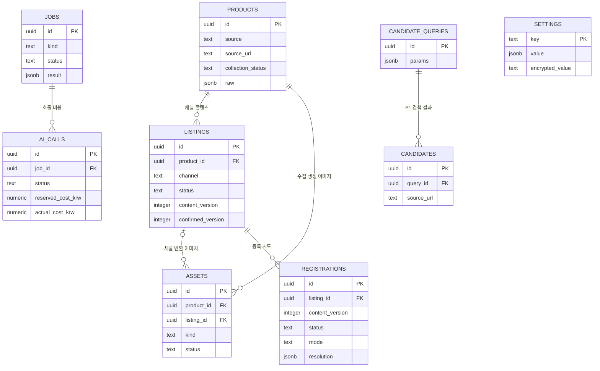

# 상품 소싱 도구 데이터베이스 설계

작성일: 2026-09-30. 갱신일: 2026-10-01. 초기 7개 테이블과 상품 수집 필드 추가 마이그레이션을 구현하고 SQLite에서 적용했다. PostgreSQL 실실행은 미검증이며 논리 설계와 실제 SQLite 검증을 구분한다.

## 공통 규칙

PK는 UUID, 시각은 timestamptz로 UTC 저장하고 화면·예산 기간은 Asia/Seoul로 계산한다. 금액은 numeric(18, 4), 비율은 numeric(8, 6)로 저장하며 float를 쓰지 않는다. 원화 표시의 반올림은 계산 후 UI에서 한다. 미수집 값은 null이고 미확인 값에 임의 기본값을 넣지 않는다.

FK는 삭제 제한을 기본으로 한다. 1차에는 상품·원본·자산·등록 이력을 삭제하는 API를 제공하지 않는다. JSONB 컬럼도 Pydantic 스키마로 검증한다. raw만 원본 구조를 유지한다. 민감한 인증정보는 raw와 작업·등록 로그에 포함하지 않는다.

## ERD

## products 상품 원본과 표준 정보

| 컬럼 | 타입과 조건 | 의미 |
| --- | --- | --- |
| id | uuid PK | 수집 1회당 새 ID |
| source / source_url / fetched_at | text NOT NULL / text NOT NULL / timestamptz NOT NULL | 소싱처와 검증된 입력 URL, 수집 시각 |
| source_product_id | text NULL | 소싱처 상품 ID, 확인 못하면 null |
| acquisition_mode | text NOT NULL | live / mock |
| collection_status | text NOT NULL | complete / partial / failed |
| name / currency | text NULL / text NULL | 상품명과 원본으로 확인된 통화 |
| wholesale_price | numeric NULL, 0 이상 | 상품 기본 도매가. 옵션별 차이는 options에 기록 |
| price_tiers | jsonb NOT NULL, 기본 빈 배열 | 최소 수량과 적용 단가. 수량별 차등 가격이 있으면 기본 도매가는 null일 수 있음 |
| minimum_order_quantity / stock_quantity | integer NULL, 0 이상 | 최소 주문 수량과 상품 전체 재고 |
| purchase_unit / maximum_order_quantity | integer NULL, 1 이상 | 구매 단위와 최대 구매 수량 |
| options / images / shipping | jsonb NULL | 표준 옵션·이미지 참조·배송 조건 |
| detail_html | text NULL | 수집 상세 HTML. 화면에 직접 렌더링하지 않음 |
| detail_text | text NULL | HTML 본문에서 추출한 실제 설명 텍스트. 이미지 OCR 결과가 아님 |
| raw | jsonb NOT NULL | 인증정보를 제외한 원본 상품 응답 |
| issues | jsonb NOT NULL, 빈 배열 가능 | 누락·정규화 오류·다운로드 경고 |
| created_at | timestamptz NOT NULL | 저장 시각 |

options 원소는 source_option_id, label, attributes, wholesale_price, stock_quantity, available을 가진다. 각 값은 원본 확인 범위만 저장한다. 옵션 없음이 확인되면 빈 배열, 확인하지 못하면 null이다. images 원소는 source_url, role, sort_order를 가진다. 다운로드 결과는 assets에 둔다. shipping은 fee, fee_type, free_shipping_threshold, remote_area_fee, dispatch_days, origin을 가진다. 이 내부 필드가 특정 외부 필드를 뜻한다고 추정하지 않는다.

원본 응답이 있는 정규화 실패는 name 등을 null로 두고 failed로 저장한다. 원본을 받기 전 실패하면 Product를 만들지 않고 jobs에 실패를 남긴다. 이미지 실패는 collection_status를 partial로 표시한다. 재수집은 이전 값을 덮어쓰지 않는다. 인덱스는 created_at, (source, collection_status), (source, source_product_id)이며 마지막 인덱스는 UNIQUE가 아니다.

## listings 채널별 검토 콘텐츠

| 컬럼 | 타입과 조건 | 의미 |
| --- | --- | --- |
| id / product_id | uuid PK / uuid FK NOT NULL | 상품별 채널 콘텐츠 |
| channel | text NOT NULL | coupang / smartstore |
| content_mode | text NOT NULL | live / mock / mixed, 텍스트·이미지 생성 출처를 반영 |
| title / detail_html | text NULL | 편집 제목과 정제된 HTML |
| thumbnail_ids | jsonb NOT NULL, 빈 배열 가능 | 후보 자산 ID 목록 |
| selected_thumbnail_id | uuid FK assets.id NULL | 선택한 썸네일 |
| sale_price / currency | numeric NULL, 0 이상 / text NULL | 판매가와 통화 |
| category_code | text NULL | 공식 규격으로 확인한 카테고리 |
| options / shipping / notices / channel_fields | jsonb NOT NULL | 채널 검토 값, 미확인 값은 null |
| status | text NOT NULL | draft / confirmed / registered |
| content_version | integer NOT NULL, 1 이상 | 콘텐츠 변경마다 증가 |
| confirmed_version / confirmed_at | integer NULL / timestamptz NULL | 사람이 확정한 버전·시각 |
| created_at / updated_at | timestamptz NOT NULL | 작성·변경 시각 |

UNIQUE(product_id, channel)로 1차는 상품당 채널별 콘텐츠 1개만 유지한다. P1 생성 이력 되돌리기는 구현하지 않는다. 다만 등록 당시 콘텐츠·요청 스냅샷은 registrations에 반드시 보존한다.

draft는 confirmed_version·confirmed_at이 null이다. confirmed·registered는 confirmed_version=content_version이고 confirmed_at이 있다. CHECK로 보장한다. 변경 요청은 expected_version을 받아 오래된 화면의 덮어쓰기를 거부한다. 콘텐츠 저장·생성 결과 적용은 버전을 증가시키고 draft로 바꾼다. 같은 상품의 자산만 연결하며 등록 진행·unknown·registered 상태에서는 수정·재생성을 막는다.

## assets 이미지 자산

| 컬럼 | 타입과 조건 | 의미 |
| --- | --- | --- |
| id / product_id | uuid PK / uuid FK NOT NULL | 생성 전 수집 이미지도 상품에 귀속 |
| listing_id | uuid FK NULL | 공통 원본·썸네일은 null, 채널 변환본은 listing 지정 |
| kind | text NOT NULL | source / thumb / detail |
| status / mode | text NOT NULL | ready / failed, live / mock |
| source_url / parent_asset_id | text NULL / uuid FK NULL | 다운로드 출처 또는 변환 전 자산 |
| path / mime_type / width / height / checksum | text·integer NULL | 저장된 파일 정보. ready는 path 필수 |
| prompt / error | text NULL | 생성 프롬프트와 비밀 제거 오류 |
| created_at | timestamptz NOT NULL | 자산 기록 시각 |

상품당 생성 썸네일 3안을 공유하고 채널별 변환본을 만든다. 같은 파일의 소유권과 부모 관계는 서비스가 검사한다. 이미지 API 업로드 이후 받은 채널 URL은 등록 응답 스냅샷에 보존한다. 파일 경로는 저장소 내부 상대 경로만 허용한다.

## registrations 삭제하지 않는 등록 시도

| 컬럼 | 타입과 조건 | 의미 |
| --- | --- | --- |
| id / listing_id | uuid PK / uuid FK NOT NULL | 등록 시도마다 별도 ID |
| channel / mode | text NOT NULL | coupang / smartstore, live / mock |
| content_version / listing_snapshot | integer NOT NULL / jsonb NOT NULL | 실행 당시 확정 버전·콘텐츠 |
| status | text NOT NULL | pending / running / succeeded / failed / unknown / simulated |
| external_id / external_url | text NULL | 실제 성공 결과만 저장 |
| request / response | jsonb NULL | 인증정보를 제거한 전송·수신 데이터 |
| error_code / error_message | text NULL | 사람이 읽을 수 있는 원인 |
| resolution | jsonb NULL | unknown 해소 시각·근거·결론·외부 ID |
| created_at / started_at / finished_at | timestamptz NOT NULL / NULL / NULL | 시도 생명주기 |

listing별 pending·running·unknown을 대상으로 부분 UNIQUE 인덱스를 두어 미해결 시도 중 새 등록을 막는다. succeeded는 listing을 registered로 만들고 failed·simulated는 confirmed를 유지한다. mock은 external_id·external_url을 null로 유지한다. unknown 해소는 기존 request·response·error를 보존하면서 resolution을 추가하고 상태를 변경한다.

등록 생성 트랜잭션에서 listing 행을 잠그고 확정 버전·미해결 시도·실등록 여부를 다시 검사한다. pending과 job을 먼저 커밋한 뒤 외부 호출한다. 결과 갱신과 listing 상태 변경은 한 트랜잭션이다. 전송 직전 running을 기록한다. 이후 프로세스 중단은 unknown으로 복구한다.

## jobs 단일 프로세스 작업

| 컬럼 | 타입과 조건 | 의미 |
| --- | --- | --- |
| id | uuid PK | API 응답과 화면 조회용 ID |
| kind | text NOT NULL | collect / generate / register, discover는 P1 |
| target_key | text NOT NULL | 중복 실행 검사 대상 |
| status | text NOT NULL | queued / running / succeeded / partial / failed / interrupted |
| payload / result / log | jsonb NOT NULL | 비밀 제거 입력, 결과 ID·채널별 결과, 상태·오류 기록 |
| created_at / started_at / finished_at | timestamptz NOT NULL / NULL / NULL | 작업 시각 |

queued·running의 (kind, target_key)에 부분 UNIQUE 인덱스를 둔다. generate의 target_key는 product ID, register는 product ID, collect는 소싱처·검증 URL이다. 작업 실행은 단일 디스패처에서 직렬화한다. 생성과 등록 모두 같은 상품의 진행 중 작업을 검사해 충돌을 거부한다.

재시작 시 queued와 running은 interrupted로 표시하고 자동 재전송하지 않는다. 관련 registration이 pending이고 아직 호출 전이면 failed, running이면 unknown으로 만든다. 공급자 호출 여부가 불명확한 AI 예약은 아래 규칙을 적용한다. jobs는 취소·분산 큐·주기적 재실행 기능을 갖지 않는다.

## ai_calls 호출 예산과 사용량

| 컬럼 | 타입과 조건 | 의미 |
| --- | --- | --- |
| id / job_id | uuid PK / uuid FK NOT NULL | 텍스트 또는 이미지 호출 1회 |
| provider / model / kind / mode | text NOT NULL | 공급자·모델·text/image·live/mock |
| budget_day / budget_month | date NOT NULL | 예약 시 서울 날짜, 월은 1일 |
| status | text NOT NULL | reserved / running / settled / released / unknown |
| reserved_cost_krw / actual_cost_krw | numeric NOT NULL, 0 이상 / numeric NULL | 호출별 상한 예약과 확인된 비용 |
| input_tokens / output_tokens / image_count | integer NULL, 0 이상 | 실제 사용량 |
| pricing_snapshot / usage / error | jsonb NOT NULL / jsonb NULL / text NULL | 예약 때 적용 단가·환산·상한, 비밀 제거 결과 |
| resolution | jsonb NULL | unknown 정산 확인 시각·근거·확인 비용 |
| created_at / finished_at | timestamptz NOT NULL / NULL | 예약·정산 시각 |

일·월 각각 settled 실제 비용과 reserved·running·unknown 예약액을 합산한다. released는 비용을 합산하지 않는다. mock은 0원이고 유료 집계에서 제외한다. 설정의 ai_budget_lock 행을 잠근 트랜잭션에서 일·월 여유를 검사하고 예약 레코드를 만든다. 외부 호출 중 DB 잠금은 유지하지 않는다.

예약액보다 실제 비용이 커지면 실제 비용을 기록하고 후속 호출을 중단한다. 날짜를 넘긴 호출은 예약한 날짜에 귀속한다. 시각·공급자·가격 조건 확인 전에는 새로 정산하지 않는다. 재시작 시 reserved는 미전송이 확실할 때만 released, running은 unknown으로 표시한다. 원인을 모르는 실패도 unknown으로 예약을 유지한다.

## settings 일반 설정과 암호화 값

key(text PK), value(jsonb NULL), encrypted_value(text NULL), updated_at(timestamptz NOT NULL)를 둔다. 일반 설정은 value만, 비밀 설정은 encrypted_value만 사용하도록 CHECK를 둔다. 암호화 키는 env에서 읽는다. 로그인 비밀번호는 사용하지 않는다.

| 키 또는 키 그룹 | 값과 초기 상태 |
| --- | --- |
| daily_ai_limit / monthly_ai_limit | KRW 한도, 합의 전 null이므로 유료 호출 차단 |
| ai_pricing / ai_provider / ai_model | 공급자별 확인 단가·환산 기준·호출 제한, 미확정은 null |
| ai_budget_lock | 비용 예약 잠금용 내부 행 |
| default_tone | 검수 전 내부 기본 톤, 실제 문구는 prompts에서 관리 |
| channel_modes | 채널별 mock 기본값, 사람 설정으로 live 전환 |
| channel_fees / shipping_costs | 확인한 수수료·부과 기준·배송 비용, 미확정은 null |
| channel_credentials / ai_credentials | 암호화 비밀, 최초 미설정 |
| collection_limits | 브라우저 요청 간격 2초 이상, 동시성 1, 내부 타임아웃·파일 크기 제한 |

설정 API는 허용된 키만 받고 비밀을 읽어 반환하지 않는다. 로그에는 저장 여부와 변경 키만 남긴다. 설정 변경만으로 외부 호출하지 않는다.

## 선택 기능 테이블

candidate_queries와 candidates는 P1 스키마 예약이며 P0 초기 마이그레이션에 만들지 않는다. query에는 params와 created_at, candidate에는 query_id, source, source_url, name, wholesale_price, target_sale_price, residual_amount, residual_rate, competitor_min_price, competitor_count, market_query, fetched_at, raw, issues를 둔다. 미확인 외부 값은 null이다. KAMIS·score는 P2에서 별도 검토한다.

## 초기 마이그레이션과 검증

초기 DB 구현은 products·listings·assets·registrations·jobs·ai_calls·settings 7개 테이블, FK·CHECK·UNIQUE·부분 인덱스, 설정 seed를 포함한다. 설계 작성만으로 DB 구현 TASK를 완료 처리하지 않는다.

DB 통합 검증은 확정 버전 제약, 같은 listing 등록 동시 실행 차단, 콘텐츠 수정과 등록 충돌, 예산 동시 예약, 중단된 작업 복구, 원본·이력 보존을 확인한다. 스키마 변경 PR에는 Alembic 변경과 이 문서 갱신을 함께 포함한다.
