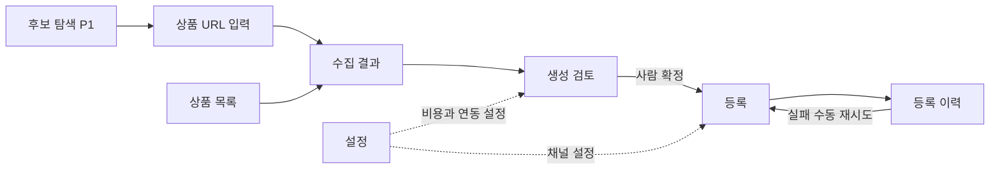

# 상품 소싱 도구 화면 설계

작성일: 2026-09-30. 상태: 화면 설계 v1, 발주자 화면 검수 대기. 아래 8개 화면 중 후보 탐색은 P1이다. 수동 입력 화면은 보류한다.

## 화면 이동

## 공통 구성

상단에는 상품 목록·상품 입력·등록 이력·설정 메뉴를 둔다. 후보 탐색은 구현 시에만 표시한다. 상품 선택 후에는 수집 결과 → 생성 검토 → 등록 순서의 진행 표시를 사용한다. 채널 탭별 상태는 독립적으로 표시한다.

비동기 작업은 작업 ID로 진행 상태를 조회한다. 실행 중에는 같은 작업 버튼을 비활성화하되 서버에서도 중복 실행을 검사한다. 새로고침 후 jobs에서 진행 상태를 복원한다. mock 화면에는 항상 연습 모드 표시를 둔다.

## 화면 1 상품 URL 입력

경로: /products/new. 요구사항: COL01, COL02, COL08.

| 영역 | 표시와 동작 |
| --- | --- |
| 입력 | 상품 URL 1개, 지원 소싱처 목록, 수집 버튼 |
| 진행 | 대기·수집 중·완료·일부 누락·실패, 실행 중 상품 URL |
| 성공 | 상품 ID를 받은 뒤 수집 결과로 이동 |
| 실패 | 사람이 읽을 수 있는 사유, 안전한 원본 링크, 수동 재시도 |
| 미지원 | 지원 소싱처가 아니라는 안내와 소싱처 추가 문서 링크 |

인증 실패·접근 거부·CAPTCHA는 원본 사이트에서 확인하도록 안내한다. 빈 수동 입력 폼으로 이동하는 기능은 1차에 만들지 않는다.

## 화면 2 수집 결과

경로: /products/{id}. 요구사항: COL03~COL07, GEN01.

상품명·도매가·옵션별 가격과 재고·최소 주문 수량·배송 조건·이미지·정제된 상세 미리보기를 표시한다. 출처 URL, 수집 시각, 실제 수집 또는 mock 여부를 함께 표시한다. 값이 없으면 미확인으로 표시하며 0으로 대체하지 않는다.

누락 필드와 이미지 다운로드 실패를 별도 목록으로 보여준다. 원본 응답은 개발·운영 점검용 접힌 영역에서 열람한다. failed 수집은 AI 생성 버튼을 비활성화한다. partial 수집은 GEN01 검사 결과에 따라 경고 후 생성하거나 생성하지 못하는 사유를 표시한다. 재수집은 새 상품 레코드로 이동하며 이전 기록 링크를 유지한다.

## 화면 3 상품 목록

경로: /products. 요구사항: COL09.

최근 수집순으로 상품명·소싱처·도매가·수집 상태·누락 수·수집 시각·mock 표시를 보여준다. 소싱처와 complete·partial·failed 상태로 필터링하고 페이지 단위로 조회한다. 같은 URL 재수집 기록은 각각 별도 행이다. 상품·원본 삭제 버튼은 제공하지 않는다.

## 화면 4 생성 검토

경로: /products/{id}/review. 요구사항: GEN01~GEN09.

| 영역 | 표시와 동작 |
| --- | --- |
| 생성 시작 | 채널 선택, 톤, 호출 전 예약 비용과 남은 일·월 한도 |
| 채널 탭 | 제목·상세 편집과 정제된 미리보기, 선택된 콘텐츠 버전·상태 |
| 이미지 | 공통 썸네일 3안과 채널 변환본, 다운로드 실패 표시, 1안 선택 |
| 등록 정보 | 판매가, 카테고리, 옵션, 배송·반품, 상품 고시·인증 정보 |
| 비용 | 입력값별 비용 반영 잔액과 미반영 비용. 값 부족 시 계산 불가 |
| 버튼 | 저장, 텍스트 다시 생성, 썸네일 다시 생성, 확정 |

확정 버튼은 저장된 현재 버전만 확정한다. 저장하지 않은 변경이 있으면 먼저 저장하도록 안내한다. 확정 후 수정·재생성은 draft로 바뀌며 다시 확인해야 한다. 일부 생성 실패 시 성공한 내용은 유지하고 실패 부분만 사람이 재생성할 수 있다.

생성 성공과 등록 준비 완료는 구분한다. 확정 시 채널 등록 필수정보를 검사하고 미확인 규격이 있으면 실등록은 보류한다. registered 콘텐츠는 읽기 전용이다. 등록 진행 중에는 해당 listing 편집·재생성·확정을 막는다.

## 화면 5 등록

경로: /products/{id}/register. 요구사항: REG01~REG03, REG07~REG09.

채널별 확정 버전·판매가·카테고리·썸네일·연동 모드·검증 결과를 보여준다. 오류와 확인 필요 항목은 해당 수정 위치로 연결한다. 화면에 보이는 버전과 요청 버전이 일치하는지 서버에서 다시 검사한다.

실등록 버튼은 confirmed이고 확정 버전이 일치하며 규격 검증을 통과한 채널에만 활성화한다. 연습 모드의 버튼은 연습 등록이라고 표시한다. 두 채널 선택 시 하나씩 실행하고 각 결과를 따로 표시한다. 실등록 성공은 외부 상품 링크, 실패는 수정 방법, unknown은 외부 등록 여부 확인 안내를 보여준다.

## 화면 6 등록 이력

경로: /registrations. 요구사항: REG04~REG06, REG08.

시도 시각·상품·채널·콘텐츠 버전·실연동 여부·pending/running/succeeded/failed/unknown/simulated 상태와 오류를 표시한다. 요청·응답 상세는 비밀을 제거한 자료만 열람한다. 이력 삭제 버튼은 없다.

failed는 현재 listing 상태를 다시 검사한 뒤 등록 화면으로 이동한다. succeeded는 재등록 불가다. unknown은 재시도 버튼을 막고 다음 중 하나를 사람이 기록한다.

- 외부 등록을 확인함: 외부 상품 ID와 근거를 기록해 succeeded로 해소한다.
- 외부 미등록을 확인함: 근거를 기록해 failed로 해소한 뒤 수동 재시도한다.

해소 전 상태·오류·응답은 resolution 필드에 추가하는 확인 기록과 함께 보존한다.

## 화면 7 설정

경로: /settings. 요구사항: GEN09, 운영과 보존.

채널별 연동 모드·키 저장 여부, AI 공급자·모델·일일/월간 비용 한도·환산 기준·당일/당월 사용량과 예약액, 채널 수수료·부과 기준·배송비·기본 톤을 표시한다. 비밀은 입력 또는 교체만 가능하고 기존 값을 다시 보여주지 않는다. 로그인·기본 인증 비밀번호 입력은 제공하지 않는다. DB 암호화 키는 env로만 관리한다.

확인되지 않은 공급자 가격·수수료·한도는 미설정으로 표시한다. 유료 호출을 활성화하려면 예산·호출별 상한이 설정되어야 한다. 연동 설정 저장만으로 외부 호출·등록은 실행하지 않는다.

과금 불명확 AI 호출은 예약액·공급자·호출 시각을 보여준다. 공급자 사용량을 확인한 뒤 사람이 실제 비용과 확인 근거를 기록해 정산한다. 확인 전에는 예약액을 계속 비용 한도에 포함한다.

## 화면 8 후보 탐색

경로: /discover. 우선순위: P1. 구현 전 메뉴 비노출.

소싱처·키워드·카테고리·도매가 범위·배송 조건으로 검색하고, 출처와 조회 시각이 있는 결과를 표시한다. 네이버 검색 최저가·검색 결과 수는 검색어와 출처를 함께 표시하며 동일 상품의 확정 경쟁 지표로 부르지 않는다. 검색 실패·미연동 값은 null이다.

후보 선택은 URL을 상품 입력 화면에 채우며 수집 버튼은 사람이 누른다. 비용 반영 잔액 정렬은 필요한 가격·비용이 있는 행에서만 가능하다. 농수산물 데이터와 AI 점수화는 P2다.

## 화면 검수 시나리오

1. 도매꾹 성공·부분 수집·로그인 필요·미지원 URL에서 다음 행동을 알 수 있다.
2. 수집 결과부터 생성·편집·확정까지 값과 버전이 유지된다.
3. 확정 뒤 가격을 바꾸면 등록 버튼이 잠기고 재확정 후 열린다.
4. 쿠팡 실패·스마트스토어 성공 결과가 각각 표시된다.
5. 응답 유실 시 재등록이 막히며 외부 확인 결과를 기록할 수 있다.
6. 비용 미설정·한도 초과 시 호출 전에 중단되고 이유가 표시된다.

이 문서는 기능·상태 설계다. 실제 화면 렌더링과 10/31 발주자 화면 검수는 구현 후 수행한다.
